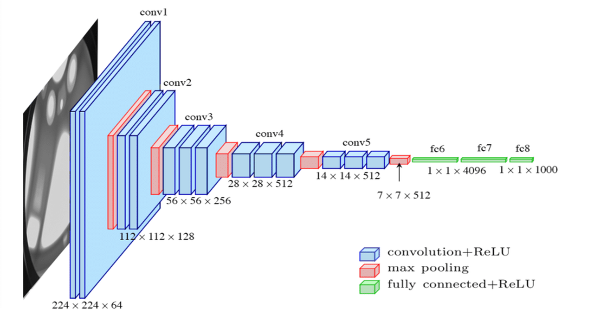

# FeXT AutoEncoder: Extraction of Images Features

## 1. Project Overview
The FeXT AutoEncoder project is centered around the development, evaluation, and application of a Convolutional AutoEncoder (CAE) model specifically designed for efficient image feature extraction. The architecture of this model draws inspiration from the renowned VGG16 model, a deep learning framework widely utilized in various computer vision tasks such as image reconstruction, anomaly detection, and feature extraction. As such, this project implements a series of stacked convolution layers, where pooling operations are performed to decrease the vector dimensions. Despite being similar to VVG16, the encoder submodel can optionally integrate a Sobel filter layer that computes the pixels gradient and join this information with a parallel convolution stream. Both the encoder and the decoder collaboratively work to extract salient features from input images, compressing the information into a lower-dimensional representation compared to the original image size. This compression allows for the retention of critical information, making the extracted features suitable for a wide range of downstream tasks.

Architecture of the VVG16 encoder

### 1.2 Supplementary information
Further information are available in the `docs` folder (to be added).

## 2. FeXT AutoEncoder model
The encoder component of the FeXT AutoEncoder is responsible for feature extraction. It achieves this through a series of convolutional layers with a kernel size of 3x3 and a stride of 1 pixel. The kernel size is chosen to be compatible with the implementation of the Sobel filter layer, which allows to extract information about the pixel gradients and use them in conjunction with the default convolution flow, with the downstream convolution layers being followed by average pooling operations. This allows to progressively downsample the spatial dimensions of the input image while expanding the channel dimensions, effectively capturing the abstract representations of the image content. Each stack of convolutional layers is stabilized with batch normalization and enhanced with ReLU activation functions to introduce non-linearity, enabling the model to learn complex patterns within the data.

In contrast, the decoder component is tasked with reconstructing the original image from the lower-dimensional encoded representation. This is accomplished by reversing the operations performed by the encoder: processing the compressed feature maps using transposed convolutions and direct upsampling with 3x3 kernels. The decoder works to reconstruct the spatial dimensions and pixel details of the original image as accurately as possible from the abstract features encoded by the model.

## 3. Training dataset
The FeXT AutoEncoder model has been trained and tested on the Flickr 30K dataset (https://www.kaggle.com/datasets/hsankesara/flickr-image-dataset), a comprehensive collection of images commonly used in many computer vision tasks. The versatility of the FeXT AutoEncoder allows it to be trained on any appropriately preprocessed image dataset, making it adaptable to a wide range of image data and tasks.

## 4. Installation
The installation process on Windows has been designed for simplicity and ease of use. To begin, simply run `FEXT_AutoEncoder.bat`. On its first execution, the installation procedure will automatically start with minimal user input required. The script will check if either Anaconda or Miniconda is installed on your system. If neither is found, you will need to install it manually. You can download and install Miniconda by following the instructions here: (https://docs.anaconda.com/miniconda/).

After setting up Anaconda/Miniconda, the installation script will install all the necessary Python dependencies. This includes Keras 3 (with PyTorch support as the backend) and the required CUDA dependencies (CUDA 12.1) to enable GPU acceleration. If you'd prefer to handle the installation process separately, you can run the standalone installer by executing `setup/FEXT_installer.bat`. You can also use a custom python environment by modifying `settings/launcher_configurations.ini` and setting use_custom_environment as true, while specifying the name of your custom environment.

**Important:** After installation, if the project folder is moved or its path is changed, the application will no longer function correctly. To fix this, you can either:

- Open the main menu, select "FEXT setup," and choose "Install project packages"
- Manually run the following commands in the terminal, ensuring the project folder is set as the current working directory (CWD):

    `conda activate FEXT`

    `pip install -e . --use-pep517` 

### 3.1 Just-In-Time (JIT) Compiler
This project leverages Just-In-Time model compilation through `torch.compile`, enhancing model performance by tracing the computation graph and applying advanced optimizations like kernel fusion and graph lowering. This approach significantly reduces computation time during both training and inference. The default backend, TorchInductor, is designed to maximize performance on both CPUs and GPUs. Additionally, the installation includes Triton, which generates highly optimized GPU kernels for even faster computation on NVIDIA hardware. For Windows users, a precompiled Triton wheel is bundled with the installation, ensuring seamless integration and performance improvements.

## 4. How to use
On Windows, run `FEXT_AutoEncoder.bat` to launch the main navigation menu and browse through the various options.  Alternatively, each file can be executed individually by running `python path/filename.py` for Python scripts or `jupyter notebook path/notebook.ipynb` for Jupyter notebooks. Please note that some antivirus software, such as Avast, may flag or quarantine python.exe when called by the .bat file. If you encounter unusual behavior, consider adding an exception for your Anaconda or Miniconda environments in your antivirus settings.

### 4.1 Navigation menu

**1) Data analysis:** runs `validation/data_validation.ipynb` to perform data validation using a series of metrics for image statistics. 

**2) Model training and evaluation:** open the machine learning menu to explore various options for model training and validation. Once the menu is open, you will see different options:
- **train from scratch:** runs `training/model_training.py` to start training an instance of the FEXT model from scratch using the available data and parameters. 
- **train from checkpoint:** runs `training/train_from_checkpoint.py` to start training a pretrained FEXt checkpoint for an additional amount of epochs, using pretrained model settings and data.  
- **model evaluation:** runs `validation/model_validation.ipynb` to evaluate the performance of pretrained model checkpoints using different metrics. 

**3) Extract features from images:** runs `inference/images_encoding.py` to select a model checkpoint and use it to extract abstract representation of image features in the form of lower-dimension embeddings, which will be saved as npy files. 

**4) FEXT setup:** allows running some options command such as **install project packages** to run the developer model project installation, and **remove logs** to remove all logs saved in `resources/logs`. 

**5) Exit and close:** exit the program immediately

### 4.2 Resources
This folder is used to organize data and results for various stages of the project, including data validation, model training, and evaluation. Here are the key subfolders:

- **checkpoints:**  pretrained model checkpoints are stored here, and can be used either for resuming training or performing inference with an already trained model.

- **dataset:** This folder contains images used to train the autoencoder model. Ensure your training data is placed here, and that the images format is of valid type (preferably either .jpg or .png).

- **extraction:**
Contains `input images` where you place images intended as an input for inference using the pretrained encoder. Moreover, hosts the folder `image features` where the resulting lower-dimension embeddings of the input images are saved (as .npy files).

- **logs:** the application logs are saved within this folder

- **validation:** Used to save the results of data validation processes. This helps in keeping track of validation metrics and logs.

## 5. Configurations
For customization, you can modify the main configuration parameters using `settings/app_configurations.json` 

#### Dataset Configuration

| Parameter          | Description                                              |
|--------------------|----------------------------------------------------------|
| SAMPLE_SIZE        | Number of samples to use from the dataset                |
| VALIDATION_SIZE    | Proportion of the dataset to use for validation          |
| IMG_NORMALIZE      | Whether to normalize image data                          |
| IMG_AUGMENT        | Whether to apply data augmentation to images             |
| SPLIT_SEED         | Seed for random splitting of the dataset                 |

#### Model Configuration

| Parameter          | Description                                              |
|--------------------|----------------------------------------------------------|
| IMG_SHAPE          | Shape of the input images (height, width, channels)      |
| APPLY_SOBEL        | Apply Sobel filter in the encoder model                  |
| SAVE_MODEL_PLOT    | Whether to save a plot of the model architecture         |
| JIT_COMPILE        | Apply Just-In_time (JIT) compiler for model optimization |
| JIT_BACKEND        | Just-In_time (JIT) backend                               |

#### Device Configuration

| Parameter          | Description                                              |
|--------------------|----------------------------------------------------------|
| DEVICE             | Device to use for training (e.g., GPU)                   |
| DEVICE ID          | ID of the device (only used if GPU is selected)          |
| MIXED_PRECISION    | Whether to use mixed precision training                  |
| NUM_PROCESSORS     | Number of processors to use for data loading             |

#### Training Configuration

| Parameter          | Description                                              |
|--------------------|----------------------------------------------------------|
| EPOCHS             | Number of epochs to train the model                      |
| LEARNING_RATE      | Learning rate for the optimizer                          |
| BATCH_SIZE         | Number of samples per batch                              |
| USE_TENSORBOARD    | Whether to use TensorBoard for logging                   |
| PLOT_EPOCH_GAP     | Epochs skipped between each point of the training plot   |

#### Evaluation Configuration

| Parameter          | Description                                              |
|--------------------|----------------------------------------------------------|
| BATCH_SIZE         | Number of samples per batch during evaluation            |    
                    
 
## 6. License
This project is licensed under the terms of the MIT license. See the LICENSE file for details.
