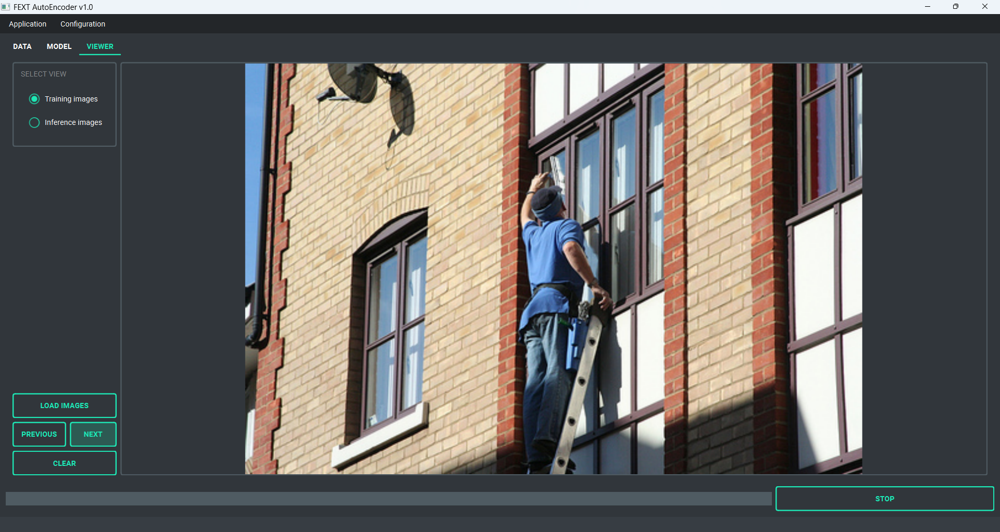

# FeXT AutoEncoder: Extraction of Images Features

## 1. Project Overview
FeXT AutoEncoder is a project centered around the implementation, training and evaluation of a Convolutional AutoEncoder (CAE) model specifically designed for efficient image feature extraction. The architecture of this model draws inspiration from the renowned VGG16 model, a deep learning framework widely utilized in various computer vision tasks such as image reconstruction, anomaly detection, and feature extraction (https://keras.io/api/applications/vgg/). Hence, the FEXT model implements a stack of convolutional layers, where pooling operations are performed to decrease the spatial dimensions multiple times. Both the encoder and the decoder collaboratively work to extract the most representative features from input images, projecting the original information into a lower-dimensional latent space that could be used for a wide range of downstream tasks.

Architecture of the VGG16 encoder

## 2. FeXT AutoEncoder model
As briefly explained, the encoder component of the FeXT AutoEncoder is responsible for image encoding into a lower-dimension latent space. It achieves this through a series of convolutional layers with a kernel size of 2x2 and a single-pixel stride, being followed by max pooling. This allows to progressively downsample the spatial dimensions of the input image while expanding the channel dimensions (depth), effectively capturing the abstract representations of the image content. Each stack of convolutional layers is parametrized to use residual connections with layer normalization, in order to mitigate issues related to vanishing gradient in deep networks.

In contrast, the decoder is responsible for reconstructing the original image from the lower-dimensional latent space. This is achieved using transposed 2D convolutions and direct nearest-pixel upsampling with 2x2 kernels. The scope of the decoder is to faithfully restore the original image by reconstructing details and pixel distribution by solely using the compressed image projections as a reference.

## 3. Training dataset
The FeXT AutoEncoder model has been trained and tested on the Flickr 30K dataset (https://www.kaggle.com/datasets/hsankesara/flickr-image-dataset), a comprehensive collection of images commonly used in many computer vision tasks. However, this model can be trained on virtually any image dataset, as the inputs will be automatically resized and normalized.

## 4. Installation
The installation process for Windows is fully automated. Simply run the script *start_on_windows.bat* to begin. During its initial execution, the script installs portable Python, necessary dependencies, and a portable version of Git, minimizing user interaction and ensuring all components are ready for local use.  

**Important:** After installation, if the project folder is moved or its path is changed, the application will no longer function correctly. To fix this, you can either:

- Open the main menu, select *Setup and maintentance* and choose *Install project in editable mode*
- Manually run the following commands in the terminal, ensuring the project folder is set as the current working directory (CWD):

    `conda activate FEXT`

    `pip install -e . --use-pep517` 

### 4.1 Just-In-Time (JIT) Compiler
This project leverages Just-In-Time model compilation through `torch.compile`, enhancing model performance by tracing the computation graph and applying advanced optimizations like kernel fusion and graph lowering. This approach significantly reduces computation time during both training and inference. The default backend, TorchInductor, is designed to maximize performance on both CPUs and GPUs. Additionally, the installation includes Triton, which generates highly optimized GPU kernels for even faster computation on NVIDIA hardware. For Windows users, a precompiled Triton wheel is bundled with the installation, ensuring seamless integration and performance improvements.

## 5. How to use
On Windows, run *start_on_windows.bat* to launch the application. Please note that some antivirus software, such as Avast, may flag or quarantine python.exe when called by the .bat file. If you encounter unusual behavior, consider adding an exception in your antivirus settings.

The main interface streamlines navigation across the application's core services, including dataset evaluation, model training and evaluation, and inference. Users can easily visualize generated plots and browse both training and inference images. Models training supports customizable configurations and also allows resuming previous sessions using pretrained models.

**Data:** the image dataset is analyzed and validated using different metrics. The following analysis are then performed on the image dataset:

- **Calculation of images statistics**: pixels mean values, standard deviation, values range, noise ratio
- **Calculation of average pixel distribution**
- **Average pixel distribution of train versus validation**   

**Model:** here you can train, evaluate and encode images with FEXT Autoencoder. You can either train from scratch or resume training for pretrained checkpoints. This tab provides also model inference and model evaluation functionalities. 

You can select a model checkpoint and use it to encode images into compact, abstract representations that capture their most relevant features. These low-dimensional embeddings are saved as .npy files in the *resources/inference* directory. For model evaluation, several metrics are computed, including:

- **Average mean squared error and mean average error of reconstruction** 
- **Visual comparison of random reconstructed images** 

**Viewer:** this tab is dedicated to image and plots visualisation, the user may select one fo the following options
- **Training images**: visualize training images located in *resources/database/dataset*  
- **Inference images**: visualize inference images located in *resources/database/inference*  
- **Dataset evaluation plots**: visualize plots generated from dataset evaluation pipeline  
- **Model evalution plots**: visualize plots generated from model evaluation pipeline  

**Setup and Maintenance:** you can run *setup_and_maintenance.bat* to start the external tools for maintenance with the following options:

- **Run installation:** run the application installer for Windows
- **Enable root path imports:** refresh root path imports if the main folder has been moved or renamed
- **Update project:** check for updates from Github
- **Remove logs:** remove all logs file from *resources/logs*

### 5.2 Resources
This folder organizes data and results across various stages of the project, such as data validation, model training, and evaluation. By default, all data is stored within an SQLite database. To visualize and interact with SQLite database files, we recommend downloading and installing the DB Browser for SQLite, available at: https://sqlitebrowser.org/dl/. The directory structure includes the following folders:

- **checkpoints:** pretrained model checkpoints are stored here, and can be loaded either for resuming training or use them for inference.

- **database:** Processed data and validation results will be stored centrally within the main database *FEXT_database.db*. All associated metadata will be promptly stored in *database/metadata*. For image training data, ensure all image files are placed in *database/images*, adhering to specified formats (.jpeg or .png). Validation outputs will be saved separately within *database/validation*. Data used for inference with a pretrained checkpoint are located in *database/inference*, where lower-dimension projections of these images are saved as .npy files.

- **logs:** log files are saved here

- **templates:** reference template files can be found here
 
**Environmental variables** are stored in the *app* folder (within the project folder). For security reasons, this file is typically not uploaded to GitHub. Instead, you must create this file manually by copying the template from *resources/templates/.env* and placing it in the *app* directory.

| Variable              | Description                                      |
|-----------------------|--------------------------------------------------|
| KERAS_BACKEND         | Sets the backend for Keras, default is PyTorch   |
| TF_CPP_MIN_LOG_LEVEL  | TensorFlow logging verbosity                     |
| MPLBACKEND            | Matplotlib backend, keep default as Agg          |

## 6. License
This project is licensed under the terms of the MIT license. See the LICENSE file for details.
